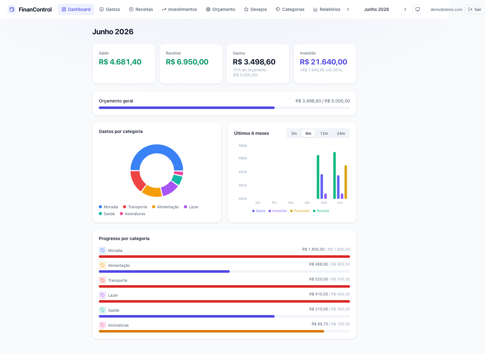
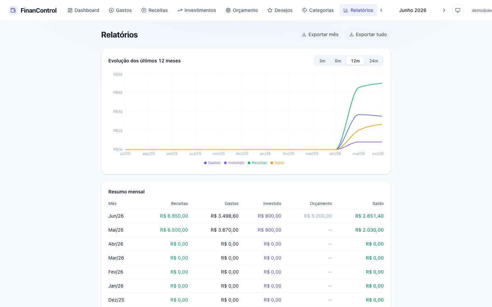
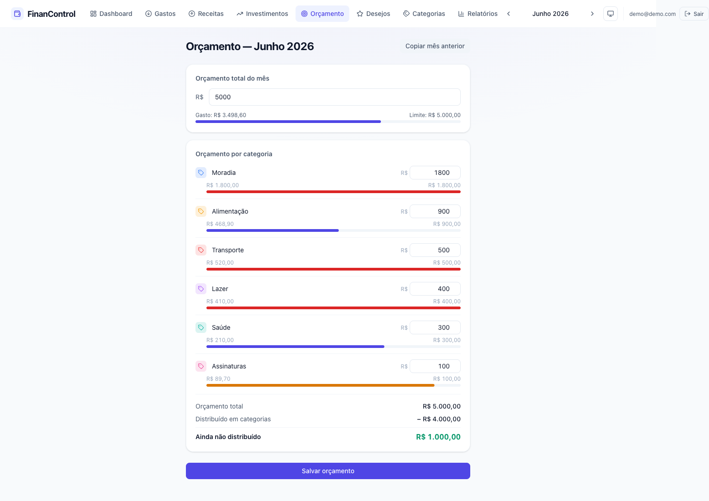
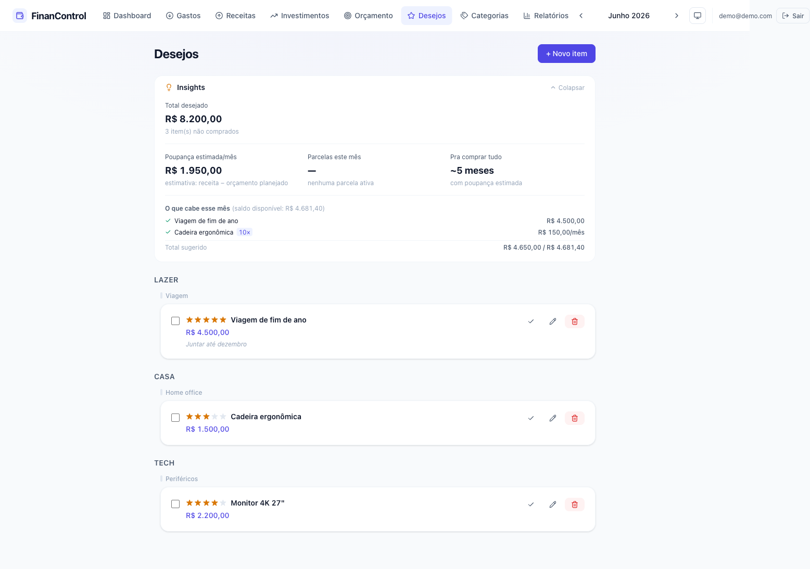

# Finance Control

A personal finance manager for tracking income, expenses, budgets, investments and a
purchase wishlist — with AI-generated monthly insights. Built as a full-stack project on
React + Supabase, with a Brazilian Portuguese (PT-BR) interface.

> **Live demo:** <!-- TODO: paste deployed URL here -->
>
> The UI is in Portuguese (R$, PT-BR labels). AI insights are restricted to the
> administrator since they call a paid LLM API.






## Features

- **Transactions** — income and expense tracking with categories, recurring entries, and
  CSV / OFX import (parse a bank statement straight into the app).
- **Budgets** — monthly total and per-category limits, tracked against actual spending.
- **Categories** — custom categories with icons, drag-and-drop ordering, and chart opt-out.
- **Investments** — contributions and withdrawals (resgates) tracked per asset.
- **Wishlist** — planned purchases with priority, installment planning, and affordability hints.
- **Reports** — charts and breakdowns of spending over time (Recharts).
- **AI insights** — Claude-generated monthly summaries and wishlist advice, with caching and
  per-month generation caps to control cost (admin-only).
- **Auth** — email/password sign-up, login, and password recovery (Supabase Auth).
- **PWA** — installable, offline-capable shell.
- **Light / dark theme** — system-aware with a manual toggle.

## Tech stack

| Layer        | Tech                                                                 |
| ------------ | -------------------------------------------------------------------- |
| Frontend     | React 19, Vite, TypeScript, Tailwind CSS v4                          |
| UI / charts  | Recharts, @dnd-kit (drag-and-drop), lucide-react, date-fns           |
| Backend      | Supabase (Postgres, Row-Level Security, Auth, Edge Functions / Deno) |
| AI           | Anthropic Claude API (via a Supabase Edge Function)                  |
| Payments     | Stripe Checkout + webhook (subscription plumbing — see note below)   |
| Tooling      | ESLint, TypeScript, PWA (vite-plugin-pwa)                            |

## Architecture

- **Data flow:** all persistence runs through hooks in [src/hooks/](src/hooks/). Each hook
  fetches from Supabase on mount, holds data in local React state, and applies mutations
  optimistically (local update first, Supabase call in the background). Supabase uses
  `snake_case`; the TypeScript domain types use `camelCase`, mapped explicitly in each hook.
- **Edge Functions** ([supabase/functions/](supabase/functions/)) keep secrets server-side:
  `ai-insights` calls the Anthropic API (the API key never reaches the client), and the
  Stripe functions handle checkout + webhooks.
- **Auth & RLS:** every table is scoped to the authenticated user via Row-Level Security
  policies ([supabase/policies.sql](supabase/policies.sql)).
- **Domain types** live in [src/types/index.ts](src/types/index.ts); navigation/state is owned
  by [src/App.tsx](src/App.tsx).

> **Note on payments / premium:** this project is a personal + portfolio app, not a paid
> product. The Stripe and subscription code remains in the repo as a reference integration,
> but no UI triggers it: new users are created on the `free` plan (no trial) and AI insights
> are restricted to the `admin` role, because each AI call costs real money.

## Running locally

Requires Node and a Supabase project.

```bash
npm install
npm run dev      # dev server at http://localhost:5173
npm run build    # type-check + production build
npm run lint     # ESLint
```

Create a `.env.local` (or `.env`) in the project root:

```
VITE_SUPABASE_URL=your-project-url
VITE_SUPABASE_ANON_KEY=your-anon-key
```

Then apply the SQL in [supabase/](supabase/) (policies, profiles, etc.) via the Supabase SQL
editor, and deploy the Edge Functions in [supabase/functions/](supabase/functions/). The
`ai-insights` function needs an `ANTHROPIC_API_KEY` secret.
